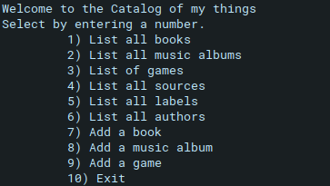

# ruby-capstone

## Description

> In this project, we create a console app that will help us to keep a record of different types of things you won: books, music albums, movies, and games. Everything will be based on the UML class diagram presented below. The data will be stored in JSON files but we also prepare a database with tables structure analogical to your program's class structure.

## Screenshot



## Learning objectives
- Insert and query data in SQL.
- Understand the different types of relationships between tables.
- Query multiple tables.
- Run a program using the command line.
- Use Ruby syntax for basic programming operations.
- Apply Ruby best practices and language style guides in code.
- Describe the SOLID principles of OOP.
- Implement classes and objects in Ruby.
- Understand the four main principles of OOP.
- Implement encapsulation and inheritance with Ruby.
- Create a UML class diagram.
- Set up associations between classes and objects.
- Store data in files.
- Build interactive console apps.
- Recognize the value of making equal contributions to group projects to produce the best outcome.


## Getting Started

- Catalog of my things" should be a simple console app that allows users to manage collections of the things they own


## Setup

### Clone this repository

```bash
$ git clone https://github.com/Lordkaito/ruby-capstone.git
$ cd ruby-capstone
```


## Install linter

```bash
$  bundle init
$  bundle install
```

## Run linter

```bash
$  rubocop .
```

### Auto-correct

In auto-correct mode, RuboCop will try to automatically fix offenses:

```bash
$ rubocop -A
# or
$ rubocop --auto-correct-all
```
## Install unit tests

```bash
$  gem install rspec  
```

## Run unit tests

```bash
$   rspec spec      
```

## Built With

This project is build with:

-  

## Authors

👤 **Isaí Céspedes Sánchez**

- GitHub: [@Lordkaito](https://github.com/lordkaito)
- Twitter: [@Lordkaito_](https://twitter.com/Lordkaito_)
- LinkedIn: [Isai Cespedes](https://www.linkedin.com/in/isai-c%C3%A9spedes-4164a51b4/)

## 🤝 Contributor

👤 **Mohamed Amine**

- GitHub: [@AmineHLub](https://github.com/AmineHLub)
- Twitter: [@Amino47612441](https://twitter.com/Amino47612441)
- LinkedIn: [LinkedIn](https://www.linkedin.com/in/mohamed-amine-hajltaief-b18863163/)


👤 **Ben Mukebo**

- GitHub: [@BenMukebo](https://github.com/BenMukebo)
- Twitter [@BenMukebo](https://twitter.com/BenMukebo)
- LinkedIn [BenMukebo](https://www.linkedin.com/in/kasongo-mukebo-ben-591720205/)

Contributions, issues, and feature requests are welcome!

Feel free to check the [issues page](https://github.com/Lordkaito/ruby-capstone/issues).

## Show your support

Give a ⭐️ if you like this project!

## Acknowledgments

- Hat tip to anyone whose code was used
- Inspiration
- etc

## 📝 License

This project is [MIT](./MIT.md) licensed.
